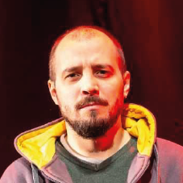

**Cristian Ezequiel Valdez Aguilar**  
**Desarrollador Full-Stack | Especialista en Backend | Iluminador Teatral**  
📍 Tucumán, Argentina  
📧 xtian7489@gmail.com | 📞 (+54) 381-3525747  
💻 [GitHub](https://github.com/xtian7489) | 🔗 [LinkedIn](https://www.linkedin.com/in/cristian-ezequiel-valdez-aguilar-b00957136/)  

---

### **Perfil Profesional**
Desarrollador Full-Stack con experiencia en la creación de aplicaciones web escalables y optimizadas. Especializado en backend con Python (Django, Flask) y Node.js, así como en frontend con Next.js y React. Habilidad para aprender rápidamente nuevas tecnologías y adaptarlas a proyectos innovadores. Además, experiencia en administración de servidores, bases de datos y despliegues en la nube. Paralelamente, trayectoria en el ámbito teatral como iluminador, sonidista y dramaturgo.

---

### **Experiencia Profesional**
#### **Democracia en Red** - Desarrollador Full-Stack *(2021 - Presente)*
- Desarrollo y mantenimiento de plataformas web para iniciativas sociales y de participación ciudadana.
- Principales proyectos:
  - [Pacto Resurgentes](https://pacto.resurgentes.org/)
  - [Bien Restituido](https://bienrestituido.democraciaenred.org/)
  - [Presupuesto Participativo MDP](https://presupuestoparticipativo.mdp.edu.ar/)
  - [Reconóceme](https://reconoceme.org/)
  - [Me Representa](https://merepresenta.info/)
- Implementación de arquitecturas escalables con Django, Flask y Next.js.
- Integración con bases de datos relacionales y NoSQL (PostgreSQL, MongoDB).
- Despliegues en AWS y Dockerización de aplicaciones.

#### **Desarrollador Full-Stack Freelance** *(2021 - Presente)*
- Creación de aplicaciones web y APIs REST utilizando Django, Flask, Next.js y Express.js.
- Integración con servicios en la nube como AWS S3 y DigitalOcean.
- Desarrollo de plataformas de e-commerce con carritos de compra y sistemas de administración de inventario.

#### **Teatro Municipal Rosita Ávila** - Técnico en Iluminación y Sonido *(2017 - 2021)*
- Diseño, programación y operación de iluminación y sonido en espectáculos teatrales.
- Coordinación técnica para eventos y funciones en vivo.

---

### **Educación**
**Universidad Nacional de Tucumán**  
*Licenciatura en Teatro* *(2010 - 2015)*  
- Título intermedio obtenido: Técnico Intérprete Dramático.

---

### **Habilidades Técnicas**
- **Backend:** Python (Django, Flask), Node.js (Express.js), Prisma.
- **Frontend:** JavaScript (React, Next.js), HTML, CSS, Tailwind.
- **Bases de datos:** PostgreSQL, MongoDB, MySQL.
- **DevOps & Cloud:** Docker, AWS (S3, EC2), DigitalOcean.
- **Herramientas & Otros:** Git, REST APIs, WebSockets, Open Graph, OpenAI.

---

### **Proyectos Destacados**
#### **Milana Shop** *(2022)*
- Desarrollo full-stack de una tienda en línea con sistema de inventario y estadísticas de ventas.
- Tecnologías: Django, React, PostgreSQL, Docker.

---

### **Idiomas**
- Español (Nativo)
- Inglés (basico)

---

### **Otros Intereses**
- Iluminación y sonido teatral.
- Dramaturgia y dirección escénica.
- Impresión 3D y electrónica.
- Domotica

---
